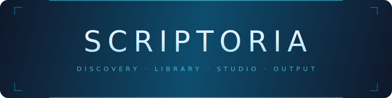
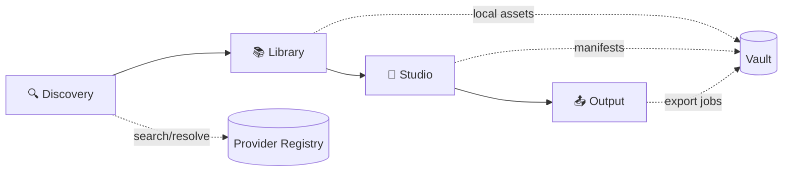

<p align="center">
  
</p>

<p align="center">
  <a href="https://github.com/nikazzio/universal-iiif-studio/actions/workflows/ci.yml"></a>
  <a href="https://github.com/nikazzio/universal-iiif-studio/actions/workflows/docs-ci.yml"></a>
  <a href="https://www.python.org/"></a>
  <a href="https://github.com/nikazzio/universal-iiif-studio/releases"></a>
  <a href="LICENSE"></a>
</p>

<p align="center">
  <strong>Scriptoria</strong> — a research workbench for IIIF manuscripts.
</p>

---

> **Web** &nbsp;`iiif-studio` → [127.0.0.1:8000](http://127.0.0.1:8000) &emsp;·&emsp;
> **CLI** &nbsp;`iiif-cli "<manifest-url>"`

<!-- TODO: add real screenshots
<p align="center">
  
  
  
</p>
-->

## Quickstart

```bash
git clone https://github.com/nikazzio/universal-iiif-studio.git
cd universal-iiif-studio
python3 -m venv .venv && source .venv/bin/activate
pip install -e .
iiif-studio
```

## How It Works



| Tab | What it does |
| --- | --- |
| **Discovery** | Resolve URLs, IDs, shelfmarks. Search 10+ IIIF libraries. |
| **Library** | Browse and manage your local manuscript collection. |
| **Studio** | Document workspace — Mirador viewer, OCR transcription, page actions. |
| **Output** | PDF inventory, thumbnail-level actions, export job queue. |

## Key Features

- **10+ IIIF providers** — Vatican, Gallica, Harvard, Bodleian, Heidelberg, LoC, Archive.org, Cambridge, e-codices, Institut
- **Provider registry** — shared resolution for web UI and CLI
- **PDF export profiles** — local and remote high-res modes with quality presets
- **Centralized HTTP** — retries, exponential backoff, per-library network policies
- **Local-first workflow** — reproducible storage, no cloud dependencies

## CLI

```bash
iiif-cli "https://digi.vatlib.it/iiif/MSS_Urb.lat.1779/manifest.json"
```

Any IIIF-compliant manifest URL works directly.

## Documentation

| | |
| --- | --- |
| 📘 [User Guide](docs/DOCUMENTAZIONE.md) | 🏗️ [Architecture](docs/ARCHITECTURE.md) |
| ⚙️ [Config Reference](docs/CONFIG_REFERENCE.md) | 🌐 [HTTP Client](docs/HTTP_CLIENT.md) |
| 📖 [Wiki](docs/wiki/Home.md) | 🗂️ [All Docs](docs/index.md) |

## Development

```bash
pytest tests/                    # tests
ruff check . --fix               # lint
ruff format .                    # format
ruff check . --select C901       # complexity
```

## Troubleshooting

<details>
<summary><code>iiif-studio: command not found</code></summary>

```bash
source .venv/bin/activate && pip install -e .
```
</details>

<details>
<summary><code>ruff: command not found</code></summary>

```bash
source .venv/bin/activate && pip install -r requirements-dev.txt
```
</details>

<details>
<summary>Port 8000 already in use</summary>

Stop the conflicting process and restart `iiif-studio`.
</details>

<details>
<summary>Studio opens without a document</summary>

Expected. Open an item from Library, or use the recent-work hub at `/studio`.
</details>

---

<p align="center">
  <sub>Built for manuscript-heavy research workflows · <a href="LICENSE">MIT</a></sub>
</p>
