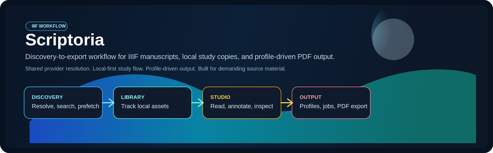
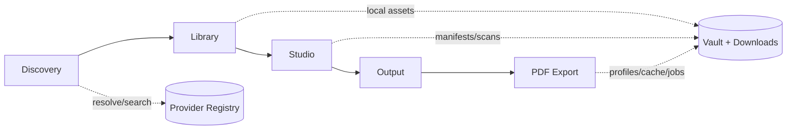

# Universal IIIF Downloader & Studio

<p align="center">
  <a href="https://github.com/nikazzio/universal-iiif-studio/actions/workflows/ci.yml"></a>
  <a href="https://github.com/nikazzio/universal-iiif-studio/actions/workflows/docs-ci.yml"></a>
  <a href="https://github.com/nikazzio/universal-iiif-studio/actions/workflows/wiki-sync.yml"></a>
  <a href="https://www.python.org/"></a>
  <a href="https://docs.astral.sh/ruff/"></a>
  <a href="https://github.com/nikazzio/universal-iiif-studio/releases"></a>
  <a href="LICENSE"></a>
</p>

<p align="center">
  
</p>

```text
 _   _       _                          _   ___ ___ ___ _____
| | | |_ __ (_)_   _____ _ __ ___  __ _| | |_ _|_ _|_ _|  ___|
| | | | '_ \| \ \ / / _ \ '__/ __|/ _` | |  | | | | | || |_
| |_| | | | | |\ V /  __/ |  \__ \ (_| | |  | | | | | ||  _|
 \___/|_| |_|_| \_/ \___|_|  |___/\__,_|_| |___|___|___|_|

 ____                      _                 _              _ _
|  _ \  _____      ___ __ | | ___   __ _  __| | ___ _ __   | (_)_ __   ___ _ __
| | | |/ _ \ \ /\ / / '_ \| |/ _ \ / _` |/ _` |/ _ \ '__|  | | | '_ \ / _ \ '__|
| |_| | (_) \ V  V /| | | | | (_) | (_| | (_| |  __/ |     | | | | | |  __/ |
|____/ \___/ \_/\_/ |_| |_|_|\___/ \__,_|\__,_|\___|_|     |_|_|_| |_|\___|_|
```

Download IIIF material, keep local working copies under control, and move from discovery to study to export without leaving one toolchain.

## Why This Project

Universal IIIF Downloader & Studio combines two workflows that are usually split apart:

- `iiif-studio` for Discovery, Library, Studio, and PDF export.
- `iiif-cli` for direct manifest-driven downloads and scripting.
- Shared provider resolution, storage, and configuration for both entrypoints.

The project is optimized for manuscript-heavy research workflows where you need fast iteration, reproducible local storage, and enough control over remote IIIF servers to avoid brittle ad-hoc tooling.



## Quickstart

```bash
git clone https://github.com/nikazzio/universal-iiif-studio.git
cd universal-iiif-studio
python3 -m venv .venv
source .venv/bin/activate
pip install -e .
iiif-studio
```

Open `http://127.0.0.1:8000`.

CLI smoke test:

```bash
iiif-cli "https://digi.vatlib.it/iiif/MSS_Urb.lat.1779/manifest.json"
```

## Feature Highlights

- Shared provider registry for web and CLI resolution.
- Search adapters for major IIIF sources plus direct manifest handling.
- Local-first study workflow with Library, Studio workspace, and Output tab.
- Remote preview vs local-only viewing modes in Mirador.
- PDF profile system with local and temporary remote high-resolution export modes.
- Centralized HTTP client with retries, backoff, and per-library policies.

## Run Modes

### Web Studio

```bash
iiif-studio
```

Alternative entrypoint:

```bash
python3 src/studio_app.py
```

### CLI

```bash
iiif-cli "<manifest-url>"
```

## Documentation Map

- [Documentation Hub](docs/index.md)
- [User Guide](docs/DOCUMENTAZIONE.md)
- [Architecture](docs/ARCHITECTURE.md)
- [Configuration Reference](docs/CONFIG_REFERENCE.md)
- [HTTP Client Notes](docs/HTTP_CLIENT.md)
- [Wiki Maintenance](docs/WIKI_MAINTENANCE.md)
- [GitHub Wiki Source](docs/wiki/Home.md)

## Current Product Shape

- `Discovery` resolves URLs, IDs, shelfmarks, and provider-specific free-text search.
- `Library` is the canonical entrypoint for local items.
- `Studio` opens a document workspace and falls back to a recent-work hub when no item is selected.
- `Output` handles PDF inventory, thumbnail-level page actions, and export jobs.

## Troubleshooting

`iiif-studio: command not found`

```bash
source .venv/bin/activate
pip install -e .
```

`ruff: command not found`

```bash
source .venv/bin/activate
pip install -r requirements-dev.txt
```

Port `8000` already in use:

- Stop the conflicting process and start `iiif-studio` again.

Studio opens without a document:

- Expected behavior. Open an item from `Library`, or resume from the recent-work hub at `/studio`.

## Development Commands

```bash
pytest tests/
ruff check . --select C901
ruff format .
```
