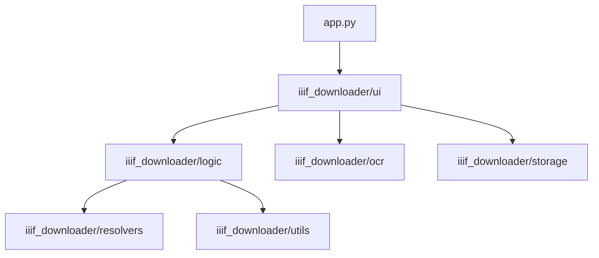

# 🏗️ Project Architecture

## Overview

**Universal IIIF Downloader & Studio** is a modular Streamlit application designed for Digital Humanities. It decouples core business logic (downloading, resolving, OCR) from the UI Presentation layer, enabling maintainability and testability.

## 📦 Module Structure

### Directory Map

*   **`iiif_downloader/logic/`**: Core business logic.
    *   `downloader.py`: Orchestrates IIIF downloads, PDF generation, and tile stitching.
*   **`iiif_downloader/resolvers/`**: Adapters for different library standards.
    *   `base.py`: Abstract interface.
    *   `vatican.py`, `gallica.py`, `oxford.py`: Specific implementations.
    *   `discovery.py`: Unified entry point for resolving shelfmarks/URLs.
*   **`iiif_downloader/ocr/`**: OCR/HTR abstraction layer.
    *   `processor.py`: Unified API for engines (Kraken, OpenAI, Google, etc.).
    *   `model_manager.py`: Manages local Kraken models.
    *   `storage.py`: Filesystem persistence for transcriptions and history.
*   **`iiif_downloader/storage/`**: Data persistence.
    *   `vault_manager.py`: SQLite database for global snippets and manuscript registry.
*   **`iiif_downloader/ui/`**: Streamlit Interface.
    *   `pages/studio_page/`: The main workspace.
        *   `canvas.py`: Main layout and text editor.
        *   `image_viewer.py`: Interactive Tiled interaction.
        *   `sidebar.py`: Contextual tools (OCR commands, metadata).
        *   `studio_state.py`: Centralized session state management.
    *   `pages/export_studio/`: PDF/Document export tools.

## 🔄 Core Workflows

### 1. Discovery & Download
1.  **Input**: User provides a shelfmark or URL.
2.  **Resolution**: `discovery.resolve_shelfmark()` identifies the library and fetches the IIIF Manifest.
3.  **Process**: `IIIFDownloader` iterates through canvases.
    *   Tries full-size image download.
    *   **Fallback**: If rate-limited or blocked, uses `iiif_tiles.stitch_iiif_tiles_to_jpeg()` to reconstruct the image from tiles (using mmap for RAM safety).
4.  **Storage**: Saves to `downloads/{Library}/{ID}/scans/`.

### 2. The Studio (Editing Loop)
1.  **Load**: `studio_state.py` loads image paths and transcription JSON.
2.  **View**: `image_viewer.py` renders the scan.
3.  **Edit**: User edits text in `text_editor.py` (Quill-based).
4.  **OCR**: User requests OCR via `sidebar.py` -> `ocr.processor.py`.
    *   Result updates the JSON and refeshes the editor.
5.  **Save**: Changes are persisted to `transcription.json` and a versioned history file.

## 🗄️ Data Persistence

### File System (`downloads/`)
Stores the bulk content (images, PDFs, JSONs).
*   `transcription.json`: Contains the current text content and OCR metadata.
*   `metadata.json`: The original IIIF manifest data.

### SQLite Vault (`data/vault.db`)
Stores structured, cross-document data.
*   **snippets**: Image crops saved by the user (Blob/Path + Metadata).
*   **manuscripts**: Registry of downloaded items (for search/indexing).

## 🚀 Key Design Decisions
*   **Stateless logic, Stateful UI**: Logic modules (`logic/`, `ocr/`) are pure Python and could run in CLI. The UI modules manage `st.session_state`.
*   **Universal Resolver Pattern**: Adding a library requires adding a single file in `resolvers/` and registering it, without touching the download engine.
*   **Hybrid OCR**: Supports both local (Kraken) and Cloud (OpenAI/Google) engines via a common strategy pattern in `OCRProcessor`.
